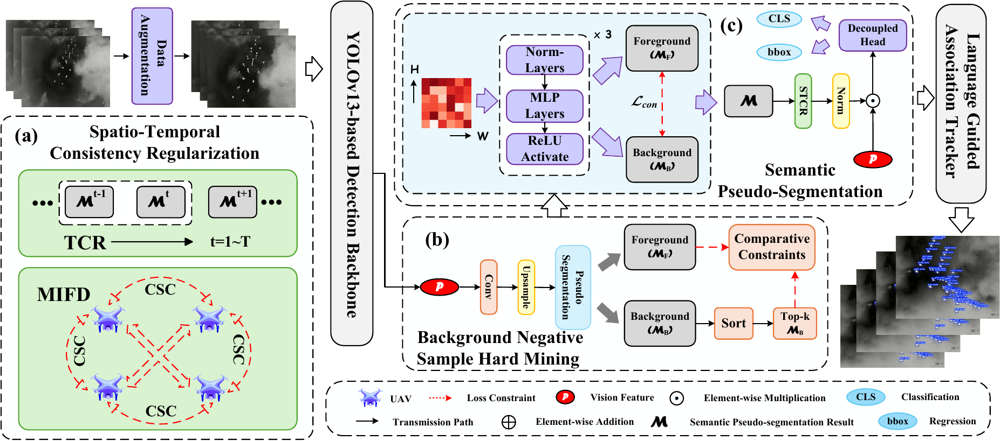

# SemTraTrack

Official implementation of **SemTraTrack: Multilevel Fusion of Semantic
Foreground Cues and Causal Trajectory Context for Robust UAV Tracking**.

SemTraTrack is trained in two stages:

1. **ISPS-SOD** augments YOLOv13-S with semantic pseudo-segmentation (SPS),
   multi-scale attention normalized Wasserstein distance (MSA-NWD), temporal
   consistency regularization (TCR), multi-instance feature decorrelation
   (MIFD), and background negative-sample hard mining (BNS-HM).
2. **LGATracker** combines four detection-track cues with strictly causal
   context constructed only from completed trajectory windows, then performs
   Hungarian assignment.

The language path is deliberately lightweight: a fixed task-specific
tokenizer, a trainable 64-D token embedding, non-padding mean pooling, and a
two-layer GELU MLP with dimensions `64 -> 128 -> 128`. It does not use a
pretrained language model.



`PAPER_CODE_ALIGNMENT.md` maps manuscript components to source files.
`IMPLEMENTATION_AUDIT.md` records the mismatches found in the earlier code and
the corrections made in this revision.

## Repository layout

```text
SemTraTrack-main/
├── configs/
├── docs/
├── examples/
├── semtratrack/
│   ├── context.py
│   ├── lgatracker.py
│   ├── sot.py
│   ├── sps.py
│   └── training/
├── scripts/
│   ├── build_pair_manifest.py
│   ├── build_assoc_pairs_from_mot.py
│   ├── train_association.py
│   ├── train_semantic_controls.py
│   ├── benchmark_e2e.py
│   └── benchmark_peak_memory.py
├── train.py
├── track_mot.py
├── track_sot.py
├── track_antiuav410.py
└── tests/
```

## Environment

The manuscript reports Python 3.11, PyTorch 2.2.2, CUDA 12.1, and an NVIDIA
A100. Create the environment and install the pinned official YOLOv13 fork:

```bash
conda env create -f environment.yml
conda activate semtratrack
bash scripts/bootstrap_yolov13.sh
```

The detector architecture is the official iMoonLab YOLOv13-S graph with
`nc=1`; the source pin is documented in `upstream/YOLOV13_PIN.md`.

## Stage I: train ISPS-SOD

Build adjacent-frame pairs from Track-3 frame folders and MOT-format identity
annotations:

```bash
python scripts/build_pair_manifest.py \
  --frames-root /path/to/Track3/frames \
  --annotations-root /path/to/Track3/Annotations \
  --out data/track3_train_pairs.jsonl
```

Expected annotation rows are:

```text
frame,id,x,y,w,h,conf,class,visibility
```

All consecutive annotated pairs are retained. TCR then selects only identities
visible in both frames; pairs without a shared identity still train the native
detector and the applicable spatial auxiliary objectives.

Train the complete detector objective:

```bash
python train.py \
  --pair-manifest data/track3_train_pairs.jsonl \
  --model configs/yolov13s-UAV.yaml \
  --data configs/MOT-UAV.yaml \
  --device 0
```

Defaults match the stated protocol: 50 epochs, image batch size 16 (eight
adjacent-frame pairs), 640x640 input, AdamW, initial learning rate `5e-4`,
weight decay `0.01`, cosine decay, five warm-up epochs, and AMP. The native
YOLOv13 loss has unit weight. Auxiliary weights are:

| Term | Weight |
|---|---:|
| foreground/background contrastive loss | 0.10 |
| MSA-NWD | 0.50 |
| TCR | 0.10 |
| MIFD | 0.05 |
| BNS-HM | 0.10 |

Additional constants are `tau_con=0.10`, `eta_nwd=0.50`, MIFD
`alpha=0.30`, `tau_soft=0.10`, and BNS-HM `r=0.02`, `gamma_h=0.30`.
`q_sep` is logged to `paper_aux_metrics.csv` for diagnosis only; it does not
enter the objective or checkpoint-selection rule.

Detector component and resolution controls require no source edits:

```bash
python train.py ... --detector-ablation w/o-tcr --imgsz 640
python train.py ... --detector-ablation w/o-sps --imgsz 640
python train.py ... --detector-ablation full --imgsz 1280
```

Available rows are `full`, `base`, `w/o-tcr`, `w/o-mifd`, `w/o-stcr`,
`w/o-bns-hm`, `w/o-msa-nwd`, and dependency-aware `w/o-sps`. The last row also
disables TCR, MIFD, and BNS-HM because they consume the SPS response, while
MSA-NWD remains enabled.

## Stage II: build the causal association corpus

The detector is frozen before LGATracker training. Export detector results
matched to ground-truth identities in MOT format, then describe every sequence
in a JSONL manifest. Each row contains a stable sequence name, MOT path, and
the original frame dimensions:

```json
{"sequence":"MultiUAV-001","mot":"detections/MultiUAV-001.txt","width":1920,"height":1080}
```

An editable example is provided at
`examples/association_sequences.example.jsonl`. Build one corpus across all
training sequences:

```bash
python scripts/build_assoc_pairs_from_mot.py \
  --sequence-manifest examples/association_sequences.example.jsonl \
  --out data/assoc_pairs.jsonl \
  --seed 0
```

For a single sequence, `--mot FILE --width W --height H` remains supported.
The generated corpus stores its temporal/cue protocol. Training rejects a
corpus whose `W_s`, `K`, `L_max`, dimensions, cue weights, state thresholds,
or motion threshold differ from the runtime configuration.

Jointly train the task-specific token embedding, language MLP, `W_g`, and
`W_e`:

```bash
python scripts/train_association.py \
  --corpus data/assoc_pairs.jsonl \
  --variant full \
  --out weights/lgatracker.pt \
  --seed 0
```

Stage II uses 50 epochs, batch size 16, AdamW with initial learning rate
`5e-4` and weight decay `0.01`, cosine decay, and five warm-up epochs.
Hungarian assignment is inference-only and is not differentiated through.

The dimensions are:

```text
E_tok: V x 64
f_mlp: 64 -> 128 -> 128 (GELU)
W_g:   4 -> 128
W_e:   128 -> 128
```

## Online multi-UAV tracking

```bash
python track_mot.py \
  --weights runs/semtratrack/isps_sod/weights/best.pt \
  --assoc-checkpoint weights/lgatracker.pt \
  --input dataset/Videos \
  --output processed_results \
  --context-variant full \
  --detector-device 0 \
  --device cuda
```

The default configuration uses `W_s=30`, history `K=10`, `L_max=5`,
`d_s=128`, and `beta=0.20`. Pairwise cue weights are
`(0.50, 0.20, 0.10, 0.20)` for position, size, state, and direction. Scale
states use original-frame box areas: small `<16^2`, large `>96^2`, and medium
otherwise. Window motion uses the original-frame diagonal
`D=sqrt(W^2+H^2)` and threshold `50/D`.

For frames in window `r`, only embeddings from completed windows through
`r-1` are available. A window is encoded only after its final association and
can affect only the next window.

## Controlled semantic-content experiments

The manuscript reports mean and standard deviation over three runs. Launch all
five context variants with the same default seeds (`0 1 2`) using:

```bash
python scripts/train_semantic_controls.py \
  --corpus data/assoc_pairs.jsonl \
  --output-dir weights/semantic_controls \
  --device cuda
```

The variants are `full`, `constant`, `shuffled-window`,
`attribute-permuted`, and `numeric`. The shuffled/permuted controls draw only
from earlier completed windows of the same sequence; their first window uses
the neutral template. Use the matching variant and seed at evaluation time.
Checkpoint loading rejects variant, seed, disabled-cue, disabled-attribute,
dimension, and temporal-protocol drift.

The detector-controlled geometry-only row needs no association checkpoint:

```bash
python track_mot.py \
  --weights weights/isps_sod_best.pt \
  --input dataset/Videos \
  --output processed_results_geometry \
  --context-variant geometry-only
```

Cue and prompt-attribute removals use `--disable-cue` and
`--disable-attribute` in both training and evaluation.

## Anti-UAV410 protocol

`track_antiuav410.py` consumes the official split layout, initializes each
sequence from `IR_label.json` only in its first frame, and writes the official
JSON result form: `[x,y,w,h]` when the target is matched and `[0]` when it is
absent/lost.

```bash
python track_antiuav410.py \
  --dataset-root /path/to/AntiUAV410 \
  --split test \
  --weights weights/isps_sod_best.pt \
  --assoc-checkpoint weights/lgatracker.pt \
  --search-factor 4.0 \
  --device cuda \
  --detector-device 0
```

Results are written to `results/AntiUAV410/test/SemTraTrack/` by default. The
tracking loop never reads later-frame ground truth.

## Generic single-object tracking protocol

`track_sot.py` also uses ground truth only in the first frame, evaluates
class-agnostic candidates in the previous estimate's search region, and writes
exactly four comma-separated `x,y,w,h` values per video frame:

```bash
python track_sot.py \
  --video sequence.mp4 \
  --first-box x,y,w,h \
  --weights /path/to/dataset_appropriate_class_agnostic_localizer.pt \
  --assoc-checkpoint weights/lgatracker.pt \
  --search-factor 4.0 \
  --out results/sequence.txt
```

The factor now defaults to `4.0`, following the published AQATrack-256 setting
associated with the AQATrack-LINR comparator. It uses AQATrack's area
convention: for a previous box of width `w` and height `h`, the code extracts a
zero-padded square crop with side `ceil(4.0 * sqrt(w*h))`. Thus, the search area
is 16 times the target-box area. `--search-factor` remains available for an
explicit sensitivity run.

LINR is a plug-in representation module for one-stream trackers, not a
standalone localization branch. Its public repository currently supplies raw
results but not executable source/configuration. Independently, this archive
still lacks the dataset-specific class-agnostic localizer checkpoints and the
training/export recipe behind the reported SemTraTrack generic-SOT row;
`track_sot.py` therefore expects an Ultralytics-compatible candidate localizer
supplied by the experimenter. See `LINR_REPRODUCTION_NOTE.md` for the exact
boundary and required materials.

## Efficiency protocol

The end-to-end benchmark uses batch size 1, 640x640 detector input, AMP, 100
warm-up frames, 1,000 timed frames, and CUDA synchronization around each timed
iteration. It includes preprocessing, detector inference, pairwise cues,
context fusion, Hungarian assignment, track update, and amortized window
mapping; it excludes file I/O, serialization, and visualization.

```bash
python scripts/benchmark_e2e.py \
  --video dataset/Videos/MultiUAV-002.mp4 \
  --weights weights/isps_sod_best.pt \
  --assoc-checkpoint weights/lgatracker.pt
```

## Validation

With the declared environment installed:

```bash
python test.py
python scripts/smoke_full_detector.py
```

The tests cover detector-objective constants, temporal pairing, causal
context, semantic controls, mapper dimensions, pairwise cues, per-image
MSA-NWD attention, and association-checkpoint protocol enforcement.

## Citing our work

The full citation format will be released once the paper is accepted—stay tuned!
